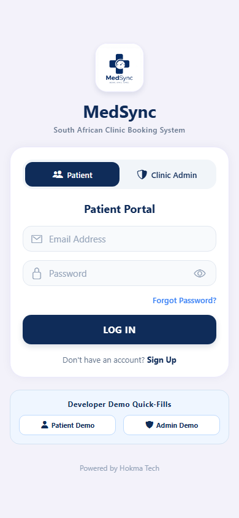
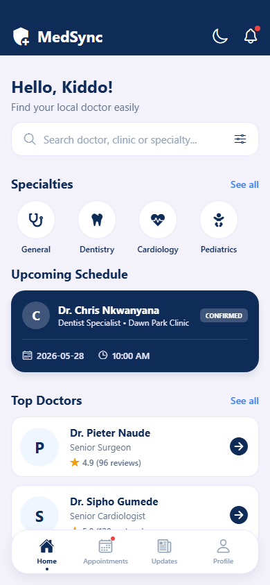
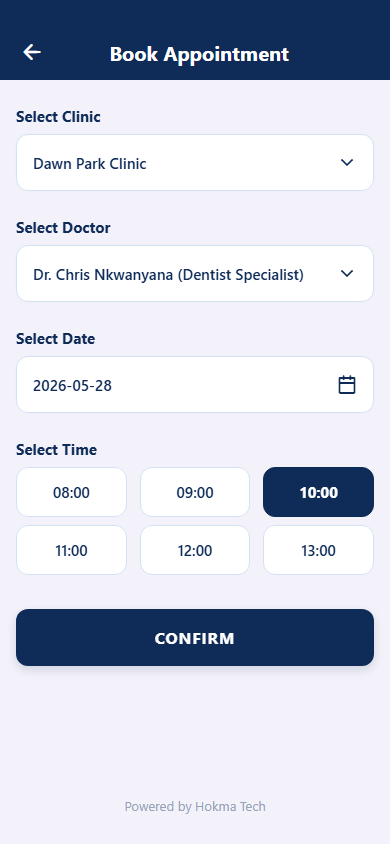
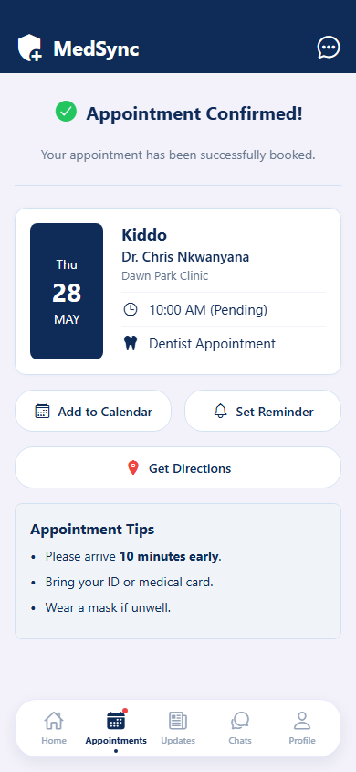

# MedSync - Powered by Hokma Tech

MedSync is a production-ready, highly modular React Native frontend application designed to seamlessly interface with a Delphi-powered REST API backend. It adheres strictly to modern UI/UX principles, employing a 60-30-10 color allocation rule to ensure visual hierarchy and a premium feel.

## 🚀 Environmental Setup Steps

This application is built using Expo for rapid cross-platform development.

1. **Clone & Navigate**
   ```bash
   git clone <repository-url>
   cd medsync
   ```

2. **Install Dependencies**
   Ensure Node.js is installed on your system.
   ```bash
   npm install
   ```
   *Required Navigational Packages:*
   ```bash
   npm install @react-navigation/native @react-navigation/native-stack react-native-screens react-native-safe-area-context
   ```

3. **Start the Application**
   ```bash
   npx expo start
   ```
   Press `a` to run on Android emulator, or `i` to run on iOS simulator.

## 📊 Current Production Sprint Status Summaries

- **UI/UX Implementation:** 100% Complete. All screens (Splash, Login, Home, Booking, Confirmation) have been rendered accurately against the layout specification.

### App UI Screenshots (Test Run)
| Splash | Login | Home |
| :---: | :---: | :---: |
|  |  |  |

| Booking | Confirmation |
| :---: | :---: |
|  |  |

- **State Management:** Local hooks implemented. Ready for Context API or Redux integration once backend endpoints are live.
- **Backend Integration:** Mock boundaries established. Components are decoupled, making it easy to swap mock functions with Axios/Fetch calls.
- **Next Sprint:** Integrate Delphi REST API, handle JWT authentication flow, and finalize push notification payloads.

## 🔌 REST API Endpoint Data Contract Specification

For the Delphi backend engineer: Below are the exact JSON payload structures expected to bridge the frontend states with the server.

### 1. Authentication (Login)
**Endpoint:** `POST /api/v1/auth/login`
**Frontend Trigger:** `SplashLoginScreen.js` -> `handleLogin()`

**Request Payload:**
```json
{
  "email": "user@example.com",
  "password": "securepassword123"
}
```

**Response Payload (Success):**
```json
{
  "status": "success",
  "token": "jwt_token_string",
  "user": {
    "id": "u_12345",
    "firstName": "Michael",
    "lastName": "Smith",
    "email": "user@example.com"
  }
}
```

### 2. Fetch Dashboard Data
**Endpoint:** `GET /api/v1/dashboard`
**Frontend Trigger:** `HomeScreen.js` -> `useEffect()` (On Mount)

**Response Payload:**
```json
{
  "status": "success",
  "data": {
    "unreadNotifications": 3,
    "upcomingReminder": {
      "date": "2026-01-12T10:00:00Z",
      "doctor": "Dr. Smith",
      "department": "General Clinic"
    }
  }
}
```

### 3. Submit Appointment Booking
**Endpoint:** `POST /api/v1/appointments/book`
**Frontend Trigger:** `BookingScreen.js` -> `handleConfirm()`

**Request Payload:**
```json
{
  "clinic": "Cape Town Family Clinic",
  "date": "2026-01-15",
  "timeSlot": "10:00"
}
```

**Response Payload (Success):**
```json
{
  "status": "success",
  "confirmationId": "APT-987654",
  "appointment": {
    "patientName": "Chris Nkwanyana",
    "clinicName": "Dawn Park Clinic",
    "dateTime": "2026-05-27T10:00:00Z",
    "department": "Dentist Appointment"
  }
}
```

## 🏗 Directory Architecture Note

- `src/constants/theme.js`: Centralized design token repository enforcing the 60-30-10 rule.
- `src/screens/`: Isolated screen components ensuring highly scannable and modular code structures.
